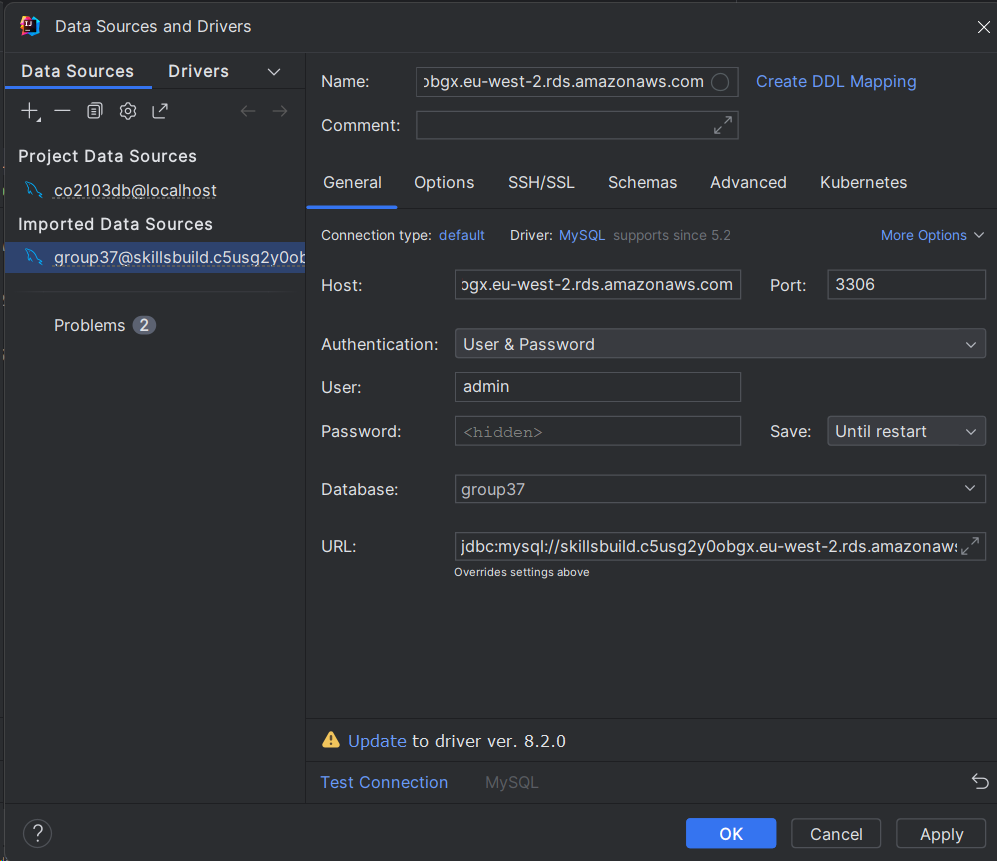

# *Welcome to Group-37 GitLab Repository*

## 1. Repository Rules

```bash
git status
```
If any changes are detected use:
```bash
git pull origin main
or 
git pull
```

## 2. Installation Guide

Follow these steps to install and run the project on your local machine:
* When the repository has been cloned, do create your own branches to avoid **MERGE CONFLICTS**.
* Always check for any recent changes by using git pull.

### Step 1: Clone the Repository

* Clone the repository via: 
```bash
git clone https://campus.cs.le.ac.uk/gitlab/co2201-2024/group-37.git
``````
* Navigate to the repository on your machine:
```bash
cd group-37
```

### Step 2: To change anything in the repository

* Create a local branch using:
```bash
git switch -c your-branch-name
```
* After working on your local branch, push it to the main branch:
```bash
git add .
git commit -a -m "Commit Message"
git push --set-upstream origin your-branch-name
```

* After setting **upstream** to the origin branch You can use this as normal:
```bash
git push origin your-branch-name
```

* Now you'll need to Merge the Commit from your local branch to the main branch.

* If you go to **Merge Request** you can use it to merge the commit.

### Step 3: Run the application

#### Generating keys
* You will need to create a new **keys.jsk** file to be able to run the application:

``` java 
keytool -genkeypair -alias tomcat -keyalg RSA -keystore ./keys.jks
```
* To generate Keys paste the code above to your IDE terminal and follow the instructions ensure to have the password as **123456** otherwise it wont work properly.


* After you are done creating put the keys.jks file from the your application directory i.e **Group37-Software_Engineering** to **Group37-Software_Engineering/src/main/resources** the resources directory and now you have to configure your **database**.

**Example Below:**

 Move from here to 


#### Connecting to AWS database
* Configuration should be available in the **application.properties of the project**
* click on the icon displaying next to the datasource.url 

* Now enter the **password** and click **Ok**.

* You should now be able to access the **database** & run the **application**.
* If there is an error in creating the **database** or **AWS** doesnt work try:
```sql
- You will also need to create a user by going to the MySql Workbench.
- Create a new Instance and name your connection to co2103db
- After creating the instance and logging in via root go to administration tab located below the schemas
- Go to users & privileges and add Account
- Add the name of account as co2103 and password as password
- Go to Administrative roles tab and select DBA and click apply
- Your new user has been created and now you can create a new database called co2103db
```
```SQL
ALternatively You can use root and create a database called co2103db
- Create a Mysql instance and create a local instance with
- user: root
- password: "replace it with your password"
and create a database called co2103db
- Re-run the application now it should work
```

#### Test accounts

There are 2 test accounts for each league in the database available for use with the usernames below and the password **password**:

| Unranked | Bronze | Silver | Gold | Platinum | Titanium | Elysium |
| --- | --- | --- | --- | --- | --- | --- |
| test0 | bronze0 | silver0 | gold0 | platinum0 | titanium0| elysium0 |
| test1 | bronze1 | silver1 | gold1 | platinum1 | titanium1 | elysium1 |

These accounts are for testing purposes only (mainly for the friends and leaderboard user story) and hence are not subject to the password strength requirements a new account would need to pass. The accounts also may not have the correct achievements unlocked initially as the points were added artificially.

## **Tech stack Used:**

### Backend
 [](https://www.java.com/)
 For backend and jsps.


 [](https://gradle.org/)
For easier project building/deployment.

 [](https://spring.io/)
 For website rendering, handling and Controlling.

### Frontend
 [](https://developer.mozilla.org/en-US/docs/Web/HTML) 
Used along jsps as frontend display

 [](https://developer.mozilla.org/en-US/docs/Web/CSS) 
Frontend styling

 [](https://getbootstrap.com/)
 Frontend styling

[](https://www.javascript.com/)
For client side styling, validation, error prevention and error handling.


 [](https://developer.mozilla.org/en-US/docs/Web/Guide/AJAX)
For server side rendering without needing to refresh pages.

### Storage & deployment
 [](https://www.mysql.com/)
 For storing data 

 [](https://aws.amazon.com/) 
 Cloud database to enable access to other people and deployment.

 [](https://railway.app/)
 For application deployment to the web.


